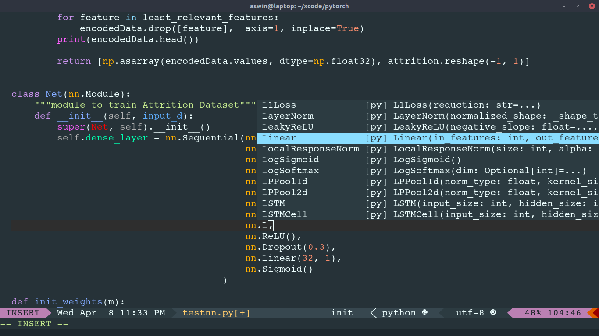
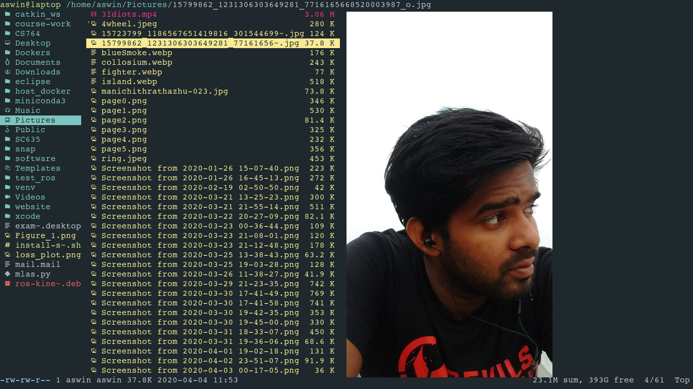
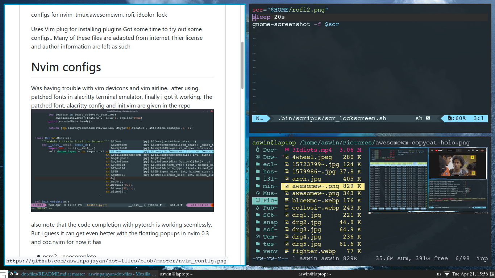

# dot-files
configs for nvim, tmux,awesomewm, rofi, i3color-lock

Uses Vim plug for installing plugins 
Got some time to try out some configs..
Many of these files are adapted from internet
Thier license and author information are left as such

# Nvim configs
Was having trouble with vim devicons and vim airline.. 
after using patched fonts in alacritty terminal emulator,
finally i got it working. The patched font, alacritty config and init.vim are 
given in the repo 

also note that the code completion with pytorch is working seemlessly.
But i guess it can get even better with the floating popups in nvim 0.3 and coc.nvim
for now it has
  * ncm2 - neocomplete
  * flake8 
  * jedi language server
  * Semshi for symantic highlighting
  * neomake 
  
Note that you might have to install flake8 seperately. Also take care you python environment using 
`python3_host_prog`. It takes care of my conda env.

# Ranger config

Ranger is a terminal based file manager . It can display files in your terminal , using ueberzug or w3m. 
But your terminal should support it. I got it working with terminology and alacritty. I am adding alacritty configs here

Of course you need a patched font for this to work.. I have uploaded Courier 10 here. You can download font of your choice from ryanoasis/nerdfonts

# General configuration
  - locking
    - i3lock-color 
    - xautolock
    - imagemagick
  - run launcher 
    - rofi
  - gtk theming
    - xsettingsd
    - gtk-chtheme
    - qt4-qtconfig
    - lxappearence
   - patched font 
    - Courier 10 Pitch for Powerline 
    
 ## Other related conf files
  - .xsettingsd for antialiasing of fonts 
  - .Xresourses
  - Pop-Black.rasi theme for rofi
  - 70-touch-pad-settings.conf - mouse settings
  - userChrome.css to get the look for firefox
  
  ### Application softwares used 
   - neovim
   - ranger as file manager 
   - alacritty as terminal emulator
   - awesomewm as window manager 
   - cmus as musicplayer 
   - zathura as document viewer
   - firefox with custom userChrome.css file
   
 Checkout awesome-copycats for awesome themes, Hollow theme(awesome-copycats)  with my tweaks
   
   
   ### GTK Theme
    - arc-darker
    - zafiro icon theme

